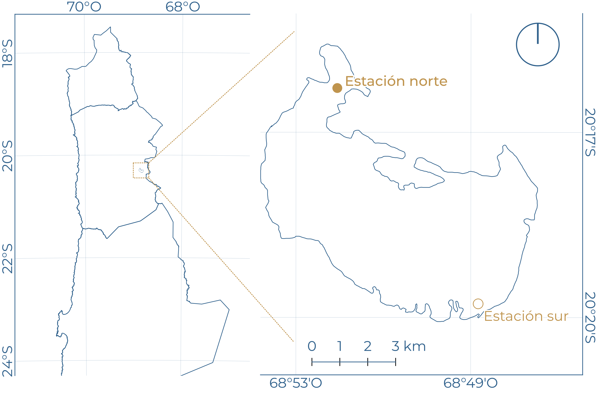
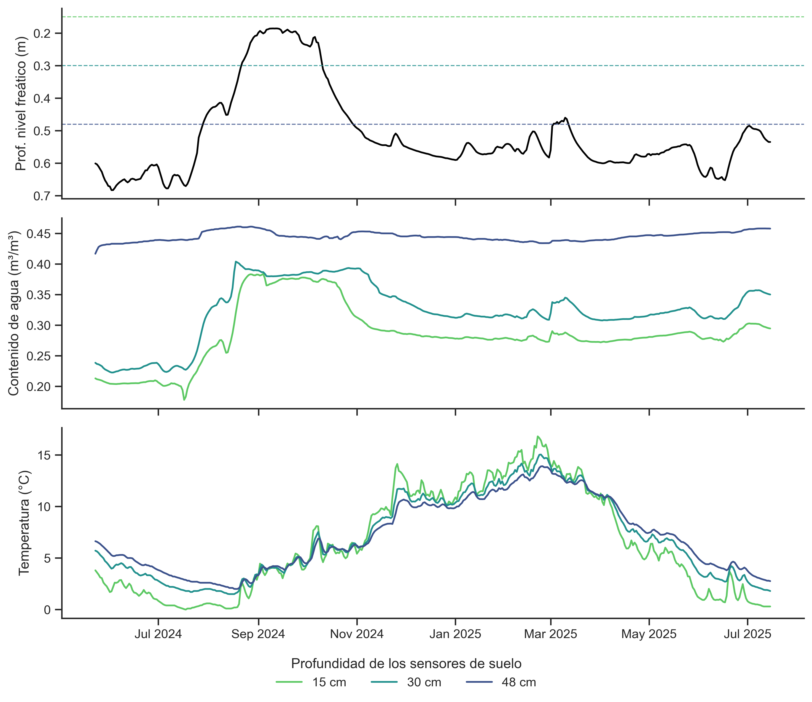
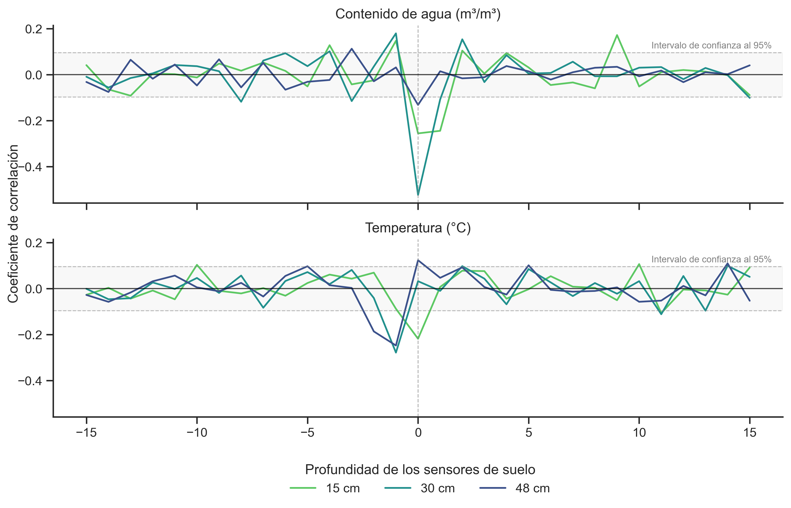
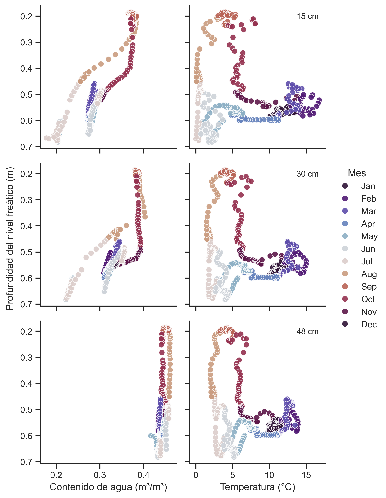
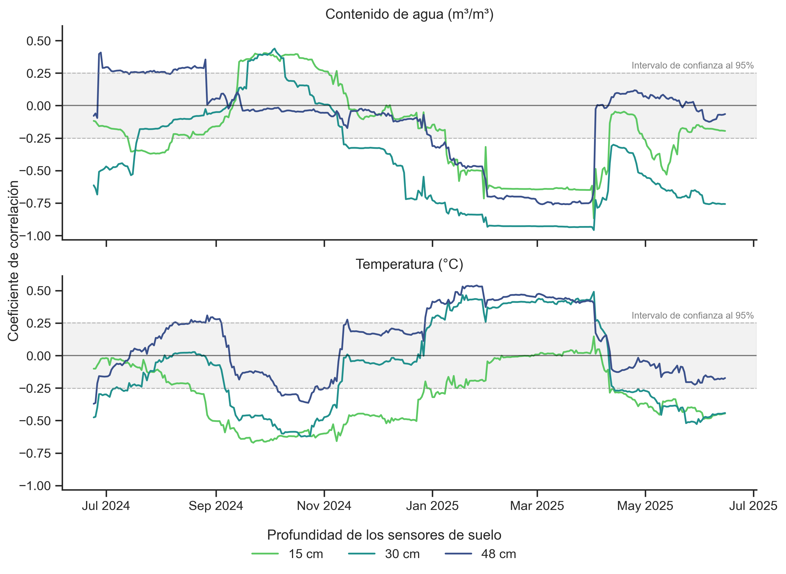
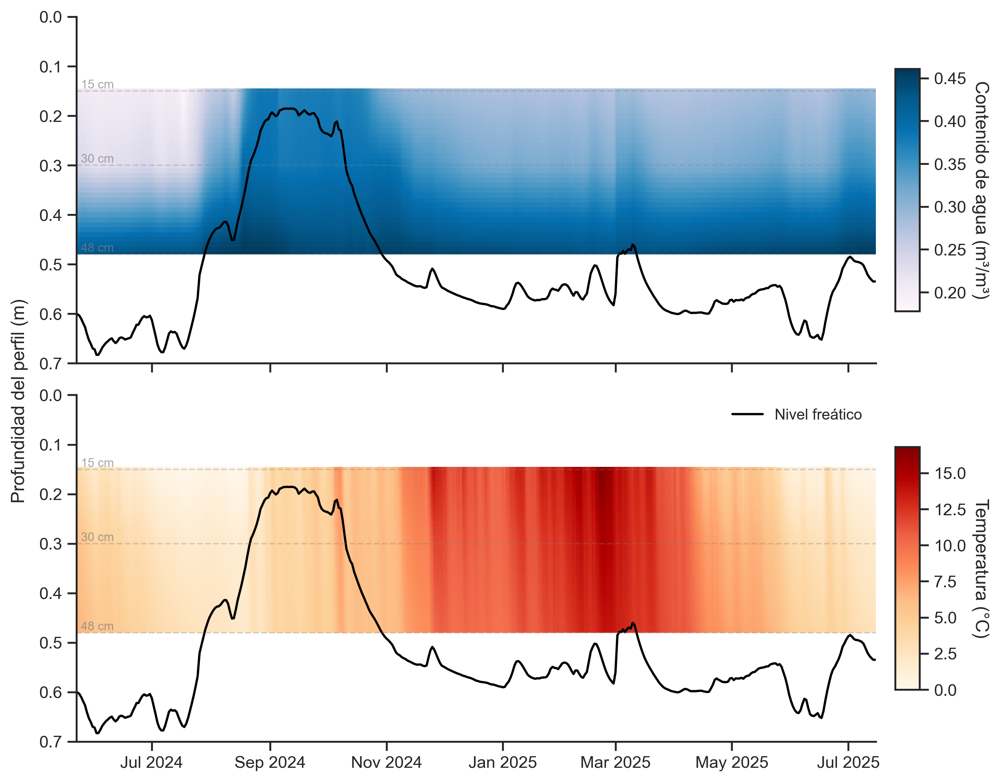

## Contexto
Los humedales altoandinos son piezas clave de los balances de agua, energía y carbono en la región del Altiplano, además de ecosistemas vitales para múltiples especies y comunidades locales. Pese a su relevancia, el cambio climático y la actividad minera están amenazando los sistemas hidrogeológicos que los sustentan. En este contexto, es relevante estudiar cómo responde el suelo ante cambios en la disponibilidad de aguas subterráneas, y así desarrollar un mejor entendimiento de las interacciones entre la zona saturada y la zona vadosa de estos sistemas.

El objetivo de este trabajo es **explorar las relaciones entre profundidad del agua subterránea y variables medidas en el suelo**, usando el Salar del Huasco como caso de estudio.

En el área de estudio se cuenta con dos estaciones de monitoreo: norte y sur (Figura 1). En este trabajo se emplearon los datos registrados en la estación norte, donde se cuenta con un piezómetro y tres sensores de suelo ubicados a diferentes profundidades (15, 30 y 48 cm). El piezómetro reporta la profundidad del nivel freático (m), mientras que los sensores de suelo, datos de contenido de agua (m³/m³) y temperatura (°C).

{width=80%}

## Análisis exploratorio
Los datos crudos registrados por los instrumentos fueron procesados previo a este análisis. Los _scripts_ están disponibles [aquí](https://github.com/pibonacic/salt-flats-groundwater-depth/tree/main/code) y un set de datos de muestra [aquí](https://github.com/pibonacic/Huasco-salt-flat-groundwater-and-soil-dynamics/tree/main/data_sample). Las visualizaciones presentadas en esta sección contemplan transformaciones de datos que no se muestran en los bloques de código desplegables; el código completo está disponible en [este notebook](https://github.com/pibonacic/salt-flats-groundwater-depth/blob/main/code/04_all-data_exploratory-visualization.ipynb). Para más información, se recomienda revisar el [README](https://github.com/pibonacic/Huasco-salt-flat-groundwater-and-soil-dynamics/blob/main/README.md) del repositorio.

#### Series temporales
En primer lugar, se graficaron las series de tiempo de profundidad del nivel freático, así como de contenido de agua y temperatura del suelo a las tres profundidades disponibles (Figura 2). Cabe mencionar que el eje Y del primer panel está invertido para facilitar la interpretación de la profundidad de las aguas subterráneas (la superficie está arriba).

Se observa que la profundidad del nivel freático es variable en el tiempo, alcanzando máximos en primavera y mínimos en invierno. Aparentemente, el contenido de agua en el suelo a 15 y 30 cm sigue un patrón similar al de las aguas subterráneas, puesto que comparten momentos de ascenso y descenso. El contenido de agua a 48 cm muestra valores altos y estables durante el año (~0.45 m³/m³), lo que sugiere que a esta profundidad el suelo alcanza la saturación.

Por otro lado, la temperatura del suelo tiene un marcado ciclo estacional, con valores máximos en verano y mínimos en invierno. A primera vista, no se observa una relación de esta variable con la profundidad del nivel freático.

```{python}
#| echo: true
#| eval: false
#| code-fold: true
#| fig-cap: 'Figura 2. Series temporales de profundidad del nivel freático, contenido de agua y temperatura del suelo.'

# Creacion de la figura base
time_series = sns.relplot(
    data=long_df,
    x='Timestamps',
    y='Value',
    hue ='Depth-label',             # Diferencia colores segun profundidad
    row='Variable-label',           # Una fila por cada variable
    palette=palette_dict,
    hue_order=full_depth_order,
    kind='line',                    # Grafico de lineas
    height=3,
    aspect=2.45,
    facet_kws={'sharey': False, 'sharex':True}      # Eje Y independiente, eje X compartido
)

# Eliminacion de elementos incluidos por defecto
time_series.set_titles('')
time_series.set_xlabels('')
time_series._legend.remove()

# Iteracion sobre facets para aplicar estilos particulares
for i, (ax, title) in enumerate(zip(time_series.axes.flat, time_series.row_names)):

    # Etiquetado de los ejes Y de cada facet
    ax.set_ylabel(title, fontweight='normal')

    # Formateo de fechas en el eje X
    date_format = mdates.DateFormatter('%b %Y')
    ax.xaxis.set_major_formatter(date_format)

    # Configuracion particular para el primer facet
    if 'Prof. nivel freático (m)' in title:
        
        # Invierte el eje Y
        ax.invert_yaxis()

        # Traza profundidad de sensores de suelo como lineas horizontales
        sensor_depths_m = [0.15, 0.30, 0.48]
        for depth, label in zip(sensor_depths_m, soil_depth_order):
            ax.axhline(y=depth, color=palette_dict[label], linestyle='--', linewidth= 0.9, alpha=0.8)

# Eliminacion de la leyenda de objetos asociados al piezometro
handles, labels = time_series.axes[0,0].get_legend_handles_labels()
clean_handles = [h for h, l in zip(handles, labels) if l != 'NA']
clean_labels = [l for l in labels if l != 'NA']

# Creacion de nueva leyenda
time_series.figure.legend(
    handles=clean_handles,
    labels=clean_labels,
    loc='lower center',
    bbox_to_anchor=(0.5, 0),
    ncol=3,
    title="Profundidad de los sensores de suelo",
    frameon=False
)

# Ajustes de espaciado
plt.tight_layout()
plt.subplots_adjust(top=0.93, bottom=0.11) # Ajusta espacio disponible para facets

plt.show()
```

{width=100%}

#### Correlaciones cruzadas
Para evaluar la existencia de desfases temporales entre las series de datos se ejecutó un análisis de correlaciones cruzadas. En él, se calculó la correlación de Pearson entre la serie de profundidad del nivel freático y las series de contenido de agua y temperatura del suelo, desplazadas temporalmente hasta ±15 días (Figura 3). Desfases mayores no entregan relaciones significativas considerando un nivel de confianza del 95%. Previo al análisis, las series fueron diferenciadas para hacerlas [estacionarias](https://otexts.com/fpp2/stationarity.html).

Para la variable de contenido de agua, se observa que la mayor correlación se da en el desfase cero, y es negativa para los tres sensores. Esto indica que un aumento en la profundidad de las aguas subterráneas se acompaña de una disminución del contenido de agua en el suelo (y viceversa). La resolución temporal del análisis no permite identificar cuál de los cambios ocurre primero, puesto que arroja que ambos suceden durante el mismo día (desfase cero). La relación más fuerte se da a 30 cm (~0.5), lo que sugiere la existencia de una buena conexión entre acuífero y suelo a dicha profundidad.

Respecto a la temperatura del suelo, se constatan correlaciones negativas en el desfase -1 en los sensores a 30 y 48 cm, y sin desfase en el sensor a 15 cm. Los valores de correlación se consideraron muy bajos para hacer interpretaciones.

```{python}
#| echo: true
#| eval: false
#| code-fold: true
#| fig-cap: 'Figura 3. Correlaciones entre series de profundidad del nivel freático y variables del suelo, desfasadas temporalmente.'

# Creacion de la figura base
cross_corr = sns.relplot(
    data=cross_corr_df,
    x='Lag',
    y='Cross-correlation',
    hue='Depth-label',
    row='Variable-label',
    palette=palette_dict,
    kind='line',
    height=3,
    aspect=2.5
)

# Eliminacion de elementos incluidos por defecto
cross_corr.set_xlabels('')
cross_corr.set_ylabels('')
cross_corr._legend.remove()

# Establecimiento de subtitulos
cross_corr.set_titles(row_template='{row_name}')

# Etiquetado del eje Y
cross_corr.figure.supylabel(
    'Coeficiente de correlación',
    x=0.04,
    size=plt.rcParams['axes.labelsize'], # Igualar tamaño al eje X
    )

# Etiquetado del eje X
ax.set_xlabel('Días de desfase')
# Trazado de lineas de referencia
for ax in cross_corr.axes.flat:

    # Trazado de lineas 0, 0
    ax.axvline(0, color='gray', linestyle='--', linewidth=0.8, alpha=0.6)
    ax.axhline(0, color='black', linestyle='-', linewidth=1, alpha=0.7)

    # Trazado de limites de confianza
    ax.axhline(conf_cross_corr, color='gray', linestyle='--', linewidth=0.8, alpha=0.5)
    ax.axhline(-conf_cross_corr, color='gray', linestyle='--', linewidth=0.8, alpha=0.5)
    ax.axhspan(-conf_cross_corr, conf_cross_corr, color='gray', alpha=0.05)

    # Anotacion del limite de confianza
    ax.text(
        x=0.82,
        y=0.87,
        s='Intervalo de confianza al 95%',
        transform=ax.transAxes,
        fontsize=8,
        color='gray'
    )  

# Creacion de nueva leyenda
cross_corr.figure.legend(
    loc='lower center',
    bbox_to_anchor=(0.53, -0.07),
    ncol=3,
    title="Profundidad de los sensores de suelo",
    frameon=False
)

# Ajustes de espaciado
plt.tight_layout()
plt.subplots_adjust(top=0.93, bottom=0.11) # Ajusta espacio disponible para facets

plt.show()
```

{width=100%}

#### Gráficos de dispersión
A fin de caracterizar la relación entre profundidad de las aguas subterráneas y las variables del suelo en diferentes temporadas, se generaron gráficos de dispersión a distintas profundidades con datos diferenciados por mes (Figura 4). Notar que los ejes Y están invertidos en todos los gráficos.

Para ambas variables se observan signos de [histéresis](https://es.wikipedia.org/wiki/Histéresis), manifestada como la existencia de diferentes caminos para el aumento y descenso de las variables. En ese sentido, se constata la existencia de relaciones no lineales entre el contenido de agua y temperatura del suelo con la profundidad del nivel freático.

Por otro lado, los gráficos permiten identificar el contenido de agua al que se alcanza la saturación en cada profundidad de suelo, la que se ve como una línea vertical. Se destaca que a mayor profundidad, más agua es capaz de contener el suelo. La independencia del contenido de agua con la profundidad del nivel freático en el sensor a 48 cm respalda su condición de saturación permanente. Del mismo modo, la temperatura parece no depender de la profundidad del agua subterránea, siendo las variaciones atribuibles a los cambios de estación.

```{python}
#| echo: true
#| eval: false
#| code-fold: true
#| fig-cap: 'Figura 4. Relaciones entre profundidad del nivel freático y variables del suelo diferenciadas mensualmente.'

# Creacion de la figura base
scatter_plot = sns.relplot(
    data=scatter_df,
    x='Value',                          # Eje X: variables de suelo
    y='Groundwater-depth-m',            # Eje Y: profundidad nivel freatico
    hue='Month',                        # Coloreado por mes
    row='Depth-label',                  # Una fila por profundidad
    col='Variable-label',               # Una columna por variable
    row_order=soil_depth_order,
    palette='twilight_shifted',         # Paleta ciclica
    kind='scatter',
    height=3,
    aspect=1,
    facet_kws={'sharey': True, 'sharex': 'col'},    # Eje Y compartido, Eje X: compartido por columnas
    s=50,
    alpha=0.9,
    legend='full'
)

# Eliminacion de elementos incluidos por defecto
scatter_plot.set_titles('')
scatter_plot.set_xlabels('')
scatter_plot.set_ylabels('')

# Etiquetado del eje X
scatter_plot.axes[-1, 0].set_xlabel("Contenido de agua (m³/m³)")
scatter_plot.axes[-1, 1].set_xlabel("Temperatura (°C)")

# Inversion del eje Y (+ margen)
y_min, y_max = scatter_df['Groundwater-depth-m'].min(), scatter_df['Groundwater-depth-m'].max()
padding = (y_max - y_min) * 0.05
scatter_plot.set(ylim=(y_max + padding, y_min - padding))

# Etiquetado del eje Y
scatter_plot.figure.supylabel(
    'Profundidad del nivel freático (m)',
    x=0.04,
    size=plt.rcParams['axes.labelsize'], # Igualar tamaño al eje X
    )

# Titulo de leyenda
legend = scatter_plot._legend
legend.set_title('Mes')

# Etiquetado de meses en leyenda
month_names = {str(i): calendar.month_abbr[i] for i in range(1, 13)}
for t in legend.texts:
    if t.get_text() in month_names:
        t.set_text(month_names[t.get_text()])

# Iteracion sobre los facets para agregar etiqueta de profundidad
for ax, label in zip(scatter_plot.axes[:, -1], soil_depth_order):
    ax.text(
        x=0.95,
        y=0.95,
        s=f'{label}',
        transform=ax.transAxes,
        ha='right',
        va='top',
        fontsize=10,
    )

# Ajustes de espaciado
plt.tight_layout()
plt.subplots_adjust(top=0.94, right=0.85) # Ajusta espacio disponible para facets

plt.show()
```

{width=100%}

#### Correlaciones móviles
Con el objetivo de visualizar la evolución de las correlaciones entre variables en diferentes estaciones del año, se hizo un análisis de correlación empleando ventanas móviles de 61 días. En él, se calculó la correlación de Pearson entre las series estacionarias para cada día disponible usando las observaciones de ±30 días, además del día presente (Figura 5). Se definió una ventana de dos meses para contar con un número de observaciones suficiente para el análisis estadístico, además de suavizar los resultados obtenidos y facilitar la interpretación.

Las correlaciones más fuertes entre contenido de agua y profundidad del nivel freatico se dan durante el verano y son inversas. Aquella es la dirección esperada de la relación, puesto que implica que a mayor profundidad del nivel freático, menor es el contenido de agua (y viceversa). En esta temporada, la relación más fuerte se manifiesta a los 30 cm, lo que es concordante con los resultados de las correlaciones cruzadas. Llamativamente, durante la primavera (sep-nov) se da una relación directa entre estas variables, coincidentemente con el _peak_ del nivel freático.

En la variable temperatura se da un patrón opuesto: en primavera se dan relaciones inversas, siendo la correlación más fuerte la del sensor a 15 cm, mientras que en verano son directas, y la correlación más fuerte está a 48 cm.

```{python}
#| echo: true
#| eval: false
#| code-fold: true
#| fig-cap: 'Figura 5. Evolución temporal de las correlaciones entre profundidad del nivel freático y variables del suelo en ventanas móviles de dos meses.'

# Creacion de la figura base
roll_corr = sns.relplot(
    data=rolling_corr_df,
    x='Timestamps',
    y='Rolling-correlation',
    hue='Depth-label',
    row='Variable-label',
    palette=palette_dict,
    kind='line',
    height=3,
    aspect=2.5
)

# Eliminacion de elementos incluidos por defecto
roll_corr.set_ylabels('')
roll_corr.set_xlabels('')
roll_corr._legend.remove()

# Establecimiento de subtitulos
roll_corr.set_titles(row_template='{row_name}')

# Etiquetado del eje Y
roll_corr.figure.supylabel(
    'Coeficiente de correlación',
    x=0.04,
    size=plt.rcParams['axes.labelsize'], # Igualar tamaño al eje X
    )

# Trazado de lineas de referencia
for ax in roll_corr.axes.flat:

    # Formateo de fechas en el eje X
    date_format = mdates.DateFormatter('%b %Y')
    ax.xaxis.set_major_formatter(date_format)

    # Trazado de linea 0
    ax.axhline(0, color='black', linestyle='-', linewidth=1, alpha=0.5)

    # Trazado de limites de confianza
    ax.axhline(conf_rolling_corr, color='gray', linestyle='--', linewidth=0.8, alpha=0.5)
    ax.axhline(-conf_rolling_corr, color='gray', linestyle='--', linewidth=0.8, alpha=0.5)
    ax.axhspan(-conf_rolling_corr, conf_rolling_corr, color='gray', alpha=0.1)

    # Anotacion del limite de confianza
    ax.text(
        x=0.82,
        y=0.8,
        s='Intervalo de confianza al 95%',
        transform=ax.transAxes,
        fontsize=8,
        color='gray'
    )    

# Creacion de nueva leyenda
roll_corr.figure.legend(
    loc='lower center',
    bbox_to_anchor=(0.5, -0.03),
    ncol=3,
    title="Profundidad de los sensores de suelo",
    frameon=False
)

# Ajustes de espaciado
plt.tight_layout()
plt.subplots_adjust(top=0.93, bottom=0.11) # Ajusta espacio disponible para facets

plt.show()
```

{width=100%}

#### Diagramas de Hövmoller
Finalmente, se construyeron diagramas de Hövmoller para representar la evolución temporal de las variables de suelo en un perfil vertical, al cual se superpuso la profundidad de las aguas subterráneas (Figura 6). El perfil se obtuvo interpolando cada un centímetro los datos entre los sensores de suelo, para cada día disponible.

En el diagrama superior se ve cómo la profundidad de las aguas subterráneas tiene un efecto sobre la distribución vertical del agua en el suelo: cuando el nivel freático está más alto, el suelo alcanza mayores valores de contenido de agua cerca de la superficie, y se reduce cuando el nivel desciende.

Por el contrario, el diagrama de temperaturas no muestra una relación aparente con el nivel freático, sin embargo, permite visualizar que la temperatura en el perfil de suelo está condicionada a lo que ocurre en superficie. Durante el invierno es el enfriamiento superior el que se transmite hacia capas profundas, mientras que en verano la existencia de pulsos de calor contribuyen a aumentar la temperatura en profundidad. La distribución temporal de los pulsos sugiere que se trata de eventos de precipitación.

```{python}
#| echo: true
#| eval: false
#| code-fold: true
#| fig-cap: 'Figura 6. Dinámica temporal de las variables de suelo en el perfil con datos interpolados verticalmente.'

# Definicion de funcion para generar un mapa de calor
def heatmap(data, **kwargs):
    
    # Pivoteo de los datos largos a matriz. La funcion de mapeo de heatmap
    # de matplotlib (pcolormesh) requiere datos en formato ancho
    pivot_data = data.pivot(index='Depth_m', columns='Date', values='Value')

    # Defincion de objetos que guardan los elementos de la matriz
    X = pivot_data.columns  # Fechas
    Y = pivot_data.index    # Profundidades
    Z = pivot_data.values   # Valores

    # Asignacion condicional de colores y etiquetas segun variable
    variable = data['Variable-label'].iloc[0]
    if 'Temperatura (°C)' in variable:
        palette = 'OrRd'
        label = 'Temperatura (°C)'
    else:
        palette = 'PuBu'
        label = 'Contenido de agua (m³/m³)'

    # Renderizado de la grilla interpolada usando pcolormesh
    mesh = plt.pcolormesh(X, Y, Z, cmap=palette, shading='auto')

    # Definicion del objeto ax
    ax = plt.gca()

    # Trazado de nivel freatico en los axes
    gw_df = kwargs.get('groundwater_data')
    col_piezo = 'Piezometer_NA_groundwater-depth_m' 
    ax.plot(
        gw_df.index, 
        gw_df[col_piezo], 
        color='black',
       linestyle='-',
        linewidth=1.5,
        label='Nivel freático'
        )

    # Creacion de leyenda
    cbar = plt.colorbar(mesh, 
                 ax=ax, 
                 label=label, 
                 pad=0.02, 
                 aspect=10,
                 shrink=0.7)
    cbar.set_label(
        label, 
        rotation=-90,
        labelpad=15
        )

hovmoller = sns.FacetGrid(
    data=hovmoller_df,
    row='Variable-label',
    height=4,
    aspect=2.2,
    sharex=True,
    sharey=True
)

# Mapeo del heatmap
hovmoller.map_dataframe(heatmap, groundwater_data=wide_df)

# Eliminacion de elementos incluidos por defecto
hovmoller.set_titles('')

# Iteracion sobre facets
for i, ax in enumerate(hovmoller.axes.flat):
    
    # Añadido de leyenda del nivel freatico 
    if i == 1:
        ax.legend(loc='upper right', frameon=False, fontsize='small', framealpha=0.8)
    
    # Formateo de fecha
    date_fmt = mdates.DateFormatter('%b %Y')
    ax.xaxis.set_major_formatter(date_fmt)

    # Añadido de profundidad de sensores
    for d in [0.15, 0.30, 0.48]:
        ax.axhline(d, color='gray', linestyle='--', alpha=0.3, linewidth=1)
        ax.text(wide_df.index[0], d, f' {d*100:.0f} cm', color='gray', va='bottom', fontsize=8, alpha=0.7)

# Inversion del eje Y
y_min, y_max = 0, 0.7
hovmoller.set(ylim=(y_max, y_min))

# Etiquetado del eje Y
hovmoller.figure.supylabel(
    'Profundidad del perfil (m)',
    x=0.04,
    size=plt.rcParams['axes.labelsize'], # Igualar tamaño al eje X
    )

# Ajustes de espaciado
plt.tight_layout()
plt.subplots_adjust(top=0.94, bottom=0.11, left=0.1) # Ajusta espacio disponible para facets

plt.show()
```

{width=100%}

## Conclusiones
Los resultados de este trabajo sugieren que existe una conexión hidráulica casi inmediata entre la profundidad del nivel freático y el contenido de agua en el suelo, identificada mediante una correlación inversa sin desfase temporal. Sin embargo, esta relación no es lineal y está condicionada por la profundidad. Los sensores profundos (48 cm) permanecen en saturación casi permanente, lo que limita su sensibilidad a las fluctuaciones del acuífero, mientras que los sensores intermedios (30 cm) ofrecen el mejor rango dinámico para inferir fluctuaciones del nivel freático debido a su ubicación en la zona de oscilación de la franja capilar.

El sistema exhibe un comportamiento complejo caracterizado por una histéresis estacional. Esto indica que los procesos de humedecimiento/secado y calentamiento/enfriamiento del suelo siguen trayectorias diferenciadas a lo largo del año. Esta complejidad se acentúa al observar la variabilidad temporal de las correlaciones en la variable de contenido de agua, puesto que el verano muestra el comportamiento inverso esperado, mientras que la primavera presenta anomalías de correlación directa. Si bien la temperatura del suelo parece estar controlada por forzantes de superficie, sin una dependencia directa de la posición del nivel freático, su análisis en el perfil vertical permitió identificar eventos de infiltración superficial.

## Agradecimientos
Esta investigación es financiada por la Agencia Nacional de Investigación y Desarrollo de Chile (ANID), mediante los proyectos ATE/230006 y FONDECYT/1251067. El autor agradece a la Asociación Indígena Aymara Laguna del Huasco y a la Corporación Nacional Forestal (CONAF) por permitir el levantamiento de datos en el Salar del Huasco.

Se extiende un agradecimiento especial a los miembros del equipo [Altiplano Wetlands](https://altiplanowetlands.cl) que con gran esfuerzo están empujando la investigación en humedales altoandinos.